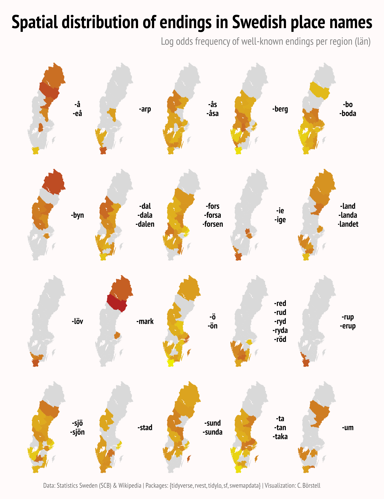

Alt-text: A map of Sweden in 20 different panels, each showing the log odds frequency of different well-known name endings in various shades of red (darker means higher prevalence; gray means no data).
